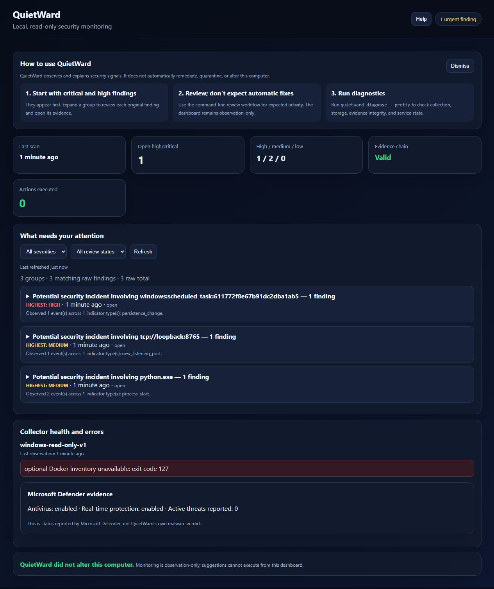

# QuietWard

QuietWard is an offline-first, observation-only cybersecurity monitor that explains suspicious host activity without silently changing the computer.

## Release status

`v0.5.0-alpha.1` is the current **detection-hardening candidate** on `feature/detection-hardening-v05`. It is not a published release until the dedicated v0.5 gate and platform qualification pass on the exact candidate SHA.

The last qualified platform targets remain:

- **Windows 11**
- **Debian 12**

Windows 10, macOS, and other Linux distributions have not completed independent qualification and are not listed as supported. QuietWard is not a replacement for Microsoft Defender or professional endpoint protection.

## What it does

QuietWard monitors processes, listening ports, persistence, selected sensitive files, local security evidence, containers when available, and its own integrity. It correlates changes into findings, stores bounded local evidence, and presents the result in a read-only localhost dashboard.

The v0.5 detection candidate strengthens that observation layer without adding remediation code:

- bounded same-host cross-subject attack-chain correlation across authentication, privilege, execution, persistence, network, malware and integrity phases;
- credential-spray recognition across one pseudonymous source and multiple installation-scoped account identities without persisting raw usernames or source IPs;
- stronger deterministic scoring for explicit high-confidence behaviors such as reverse shells, credential dumping, process injection, dangerous container configurations and corroborated credential spray;
- Windows document/PDF processes spawning high-risk interpreters/LOLBins as a high-signal parent→child behavior;
- expanded Linux/Windows behavioral markers while raw command lines remain hashed/redacted according to the existing privacy model.

On Windows, QuietWard also displays read-only Microsoft Defender status. Defender evidence is labeled separately and QuietWard does not start scans or change Defender settings.



## Windows quick start

Requirements:

- Windows 11
- Python 3.11 or newer
- PowerShell

Extract the release archive, open PowerShell in the extracted folder, and run:

```powershell
powershell.exe -NoProfile -ExecutionPolicy Bypass -File .\scripts\install_windows.ps1
```

The installer is user-scoped and creates:

- a private local virtual environment;
- private configuration, state, and evidence-signing keys;
- one limited current-user startup task;
- a desktop shortcut to the dashboard.

Open the dashboard at `http://127.0.0.1:8765/` or run:

```powershell
quietward open-dashboard --pretty
quietward diagnose --pretty
```

Run the bounded host check with:

```powershell
powershell.exe -NoProfile -ExecutionPolicy Bypass -File .\scripts\qualify_windows.ps1
```

See `docs/FIRST_RUN.md` and `docs/WINDOWS.md` for operating and troubleshooting guidance.

## Debian quick start

```bash
./scripts/install_user_service.sh
quietward doctor --config ~/.config/quietward/config.json --pretty
```

The Debian path remains observation-only.

## What users see

The local dashboard answers five practical questions:

1. Is QuietWard running normally?
2. When did monitoring last complete?
3. Which findings need attention?
4. Why was each finding raised?
5. Are there collector, database, privacy, or evidence-integrity problems?

Findings are grouped by semantic family so repeated hash-specific observations do not overwhelm the page. Each accessible disclosure preserves every original finding and incident link. Groups show their raw child count, highest severity, newest observation, review-state summary, and explanation. Filters retain only matching children, while the count line distinguishes groups, matching raw findings, displayed raw findings, and the database total.

Finding details include severity, score, allowlisted plain-language reason explanations, escaped raw technical details, supporting evidence, review state, and any non-executable remediation proposal. Exact UTC timestamps remain available in tooltips and accessible labels. Optional collector limitations are shown as warnings rather than being presented as confirmed threats.

## Safety boundary

QuietWard does not quarantine or delete files, stop processes or services, change firewall rules, isolate a host, install packages during monitoring, upload telemetry, expose a public listener, execute arbitrary commands, or perform automatic remediation.

QuietWard does not quarantine/delete files. This explicit release-contract wording is retained for automated safety verification.

Release invariants:

```text
actions_executed == 0
executable_proposals == 0
dashboard_bind == 127.0.0.1
cloud_upload == false
public_listener == false
```

Outbound connection monitoring is disabled by default. Enable it only when you are ready to establish and review a real-host baseline.

## Verify the v0.5 detection candidate

Release qualification uses pytest without making it a runtime dependency. From a release checkout, install the release-test extra:

```bash
python -m pip install -e ".[release]"
```

Then run the dedicated detection gate:

```bash
python scripts/verify_v05_detection.py
```

The gate checks the exact `0.5.0a1` version, compiles source/tests/scripts, runs the full pytest suite with warnings treated as errors, runs the public-release audit, verifies the observation-only safety invariants, and verifies v0.5 release metadata.

Platform-specific Windows 11 and Debian 12 qualification remains required on the exact candidate SHA before publication.

## Build and verify a release candidate

On Windows:

```powershell
powershell.exe -NoProfile -ExecutionPolicy Bypass -File .\scripts\build_release_candidate.ps1
```

The Windows builder invokes the exact v0.5 gate unless `-SkipTests` is explicitly supplied, then performs two deterministic builds, compares archive SHA-256 values, and verifies the final archive/manifest. A release must never be published from a `-SkipTests` build.

Linux validation:

```bash
./scripts/validate_release.sh
```

The Linux path also runs the exact v0.5 gate, builds twice, compares hashes, and runs `scripts/verify_release_bundle.py`.

## Export a redacted incident

```bash
quietward export FINDING_ID incident.json --format json --pretty
quietward export FINDING_ID incident.md --format markdown
```

Exports remain local and exclude raw sensitive identities and analyst notes.

## Documentation

Start with:

- `docs/FIRST_RUN.md`
- `docs/WINDOWS.md`
- `docs/releases/v0.5.0-alpha.1.md`
- `docs/RELEASE_CHECKLIST.md`
- `docs/INTERN_UX_ACCEPTANCE_2026_08.md`
- `docs/PRIVACY.md`
- `docs/SECURITY_MODEL.md`
- `docs/EVIDENCE_INTEGRITY.md`

## License

MIT. See `LICENSE`.

## Repository policy

Never commit malware samples, private host logs, credentials, runtime databases, scanner databases, private network inventories, raw persistence files, signing keys, or production model inputs.
