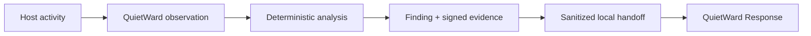

# QuietWard

**Local endpoint security that explains what changed — without giving the monitor power to change your machine.**

[](LICENSE)


QuietWard is an offline-first, observation-only endpoint security monitor for people who want useful host visibility without silently handing a security agent broad control of the computer.

It correlates processes, network activity, persistence, authentication evidence, file integrity, container state, Windows Defender context, and its own integrity into explainable findings backed by local tamper-evident evidence.

## Engineering highlights

- **Cross-platform security engineering:** Windows 11 and Debian support with platform-specific, read-only collectors.
- **Explainable detection:** deterministic scoring and multi-signal correlation instead of opaque alert-only output.
- **Privacy by design:** local-first operation, keyed pseudonymous identities, loopback-only dashboard defaults, and no cloud telemetry by default.
- **Evidence integrity:** hash-chained evidence with optional signing and independent verification.
- **Safety-constrained architecture:** the monitor cannot terminate processes, quarantine files, change firewall rules, isolate hosts, or execute arbitrary commands.
- **Release discipline:** the current paired candidate passed a 441-test QuietWard suite plus focused privacy, integrity, and handoff qualification before promotion to `main`.
- **Open-source workflow:** documented first-run, security, privacy, contribution, and community-roadmap paths for outside users and contributors.

## Try it before installing it

See the real QuietWard scoring, correlation, finding, and policy path using **synthetic data only**:

```bash
python scripts/quick_demo.py
```

For the full structured payload:

```bash
python scripts/quick_demo.py --json
```

The demo performs **no host scan, no network request, no system change, and no action execution**. It exists so a new visitor can understand the project before configuring endpoint monitoring.

See [`docs/TRY_IT.md`](docs/TRY_IT.md) for the guided walkthrough.


## Why QuietWard

| Principle | QuietWard approach |
| --- | --- |
| **Local-first** | Analysis, evidence, dashboard, and state stay on the machine by default. |
| **Observation-only** | No process termination, quarantine, firewall changes, host isolation, or arbitrary command execution. |
| **Explainable** | Findings retain deterministic reasons and supporting evidence instead of producing opaque scores alone. |
| **Privacy-conscious** | Identity-bearing authentication and network data use installation-keyed HMAC pseudonyms on supported paths. |
| **Low-overhead** | FAST, STANDARD, DEEP, and MAINTENANCE cadences stagger expensive work and reduce unnecessary writes. |
| **Tamper-evident** | Retained evidence is hash-chained and can be signed and independently verified. |

## What it watches

QuietWard combines multiple read-only host signals instead of treating each event in isolation:

- processes and parent/child behavior
- listening sockets and optional outbound network context
- persistence and account changes
- selected sensitive-file integrity
- authentication evidence
- Docker/container security state when available
- Microsoft Defender context on Windows
- QuietWard's own integrity and evidence state

Deterministic scoring and correlation cover high-signal patterns including credential spray/dumping, reverse-shell behavior, process injection markers, document-to-interpreter ancestry, suspicious Linux web/server shell ancestry, ransomware recovery inhibition, event-log clearing, dangerous container configuration, and corroborated multi-stage activity.

## QuietWard + Response

QuietWard `0.6.0a1` can hand verified findings to **[QuietWard Response](https://github.com/LUKEcheadle-ship-it/quietward-response)** through a one-way sanitized local bridge.



The bridge preserves the separation of authority:

- QuietWard stays observation-only.
- QuietWard holds no Response network credential.
- raw finding subjects and internal finding IDs do not cross the handoff boundary.
- retained evidence-chain provenance is verified before export.
- malformed provenance, changed handoff files, outbox saturation, or executable authority fail closed.

The projects can also operate independently.

## Qualification evidence

The current paired QuietWard/Response candidate was promoted to `main` only after the complete joint qualification gate passed on Linux and Windows runners, including:

- **441 QuietWard tests** with platform-appropriate skips
- **12 focused handoff/privacy/integrity tests**
- public-release audit
- evidence-chain tamper checks
- privacy and secret-key safety checks
- live QuietWard → Response acceptance
- confirmation that `actions_executed == 0` inside QuietWard

QuietWard remains an experimental security project, not a replacement for Microsoft Defender, enterprise EDR/MDR, or professional incident response.

## Safety boundary

QuietWard does **not** automatically:

- quarantine or delete files
- terminate processes or services
- change firewall rules
- isolate a host
- execute shell / PowerShell / cmd commands
- upload telemetry to a cloud service
- perform autonomous remediation

Release invariants:

```text
actions_executed == 0
executable_proposals == 0
cloud_upload == false
public_listener == false
```

The dashboard is read-only and loopback-only by default. Models may help explain or reprioritize bounded evidence, but they cannot authorize an action.

## Install the real monitor

### Windows

Requirements: Windows 11, Python 3.11+, PowerShell.

```powershell
powershell.exe -NoProfile -ExecutionPolicy Bypass -File .\scripts\install_windows.ps1
quietward status --pretty
quietward open-dashboard --pretty
quietward doctor --pretty
```

Dashboard: `http://127.0.0.1:8765/`

### Debian

```bash
./scripts/install_user_service.sh
quietward status --config ~/.config/quietward/config.json --pretty
```

## Verify the project

```bash
python scripts/validate_migrated_release.py --pretty
python scripts/verify_v06_response_handoff.py
```

## Explore or contribute

- [`docs/TRY_IT.md`](docs/TRY_IT.md) — safe first look
- [`docs/COMMUNITY_ROADMAP.md`](docs/COMMUNITY_ROADMAP.md) — public product direction
- [`docs/FIRST_RUN.md`](docs/FIRST_RUN.md) — first run
- [`docs/PRIVACY.md`](docs/PRIVACY.md) — privacy model
- [`docs/SECURITY_MODEL.md`](docs/SECURITY_MODEL.md) — security boundary
- [`docs/EVIDENCE_INTEGRITY.md`](docs/EVIDENCE_INTEGRITY.md) — evidence integrity
- [`CONTRIBUTING.md`](CONTRIBUTING.md) — contribution guide

Good-first-issue and help-wanted tasks are intentionally scoped so contributors can improve documentation, UI, tests, examples, and portability without needing to expand endpoint authority.

## License

MIT. See [`LICENSE`](LICENSE).

## Responsible public use

Never commit malware samples, private host logs, credentials, runtime databases, scanner databases, private network inventories, raw persistence files, signing keys, or production model inputs. Public issues must not contain private logs, keys, database files, or personal information.
