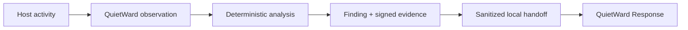

# QuietWard

**Local-first endpoint security that watches, explains, and preserves control.**

[](LICENSE)


QuietWard is an offline-first, observation-only cybersecurity monitor designed to answer a simple question:

> **What changed on this machine, why might it matter, and what evidence supports that conclusion?**

It monitors host activity, correlates related signals into explainable findings, tracks incidents over time, and preserves signed local evidence — **without silently changing the computer or giving itself a remote-command surface**.


## Why QuietWard

Most endpoint tools optimize for either visibility or control. QuietWard deliberately starts with visibility.

| Principle | QuietWard approach |
| --- | --- |
| **Local-first** | Analysis, evidence, dashboard, and state stay on the machine by default. |
| **Observation-only** | No process termination, quarantine, firewall changes, host isolation, or arbitrary command execution. |
| **Explainable** | Findings retain deterministic reasons and supporting evidence instead of producing opaque scores alone. |
| **Privacy-conscious** | Identity-bearing authentication and network data use installation-keyed HMAC pseudonyms on supported paths. |
| **Low-overhead** | FAST, STANDARD, DEEP, and MAINTENANCE cadences stagger expensive work and reduce unnecessary writes. |
| **Tamper-evident** | Retained evidence is hash-chained and can be signed and independently verified. |

## What it watches

QuietWard combines multiple read-only host signals instead of treating each event in isolation:

- processes and parent/child behavior
- listening sockets and optional outbound network context
- persistence and account changes
- selected sensitive-file integrity
- authentication evidence
- Docker/container security state when available
- Microsoft Defender context on Windows
- QuietWard's own integrity and evidence state

Deterministic scoring and correlation cover high-signal patterns including credential spray/dumping, reverse-shell behavior, process injection markers, document-to-interpreter ancestry, suspicious Linux web/server shell ancestry, ransomware recovery inhibition, event-log clearing, dangerous container configuration, and corroborated multi-stage activity.

## From detection to response

QuietWard `0.6.0a1` can hand verified findings to **[QuietWard Response](https://github.com/LUKEcheadle-ship-it/quietward-response)** through a one-way, sanitized local bridge.



The bridge preserves the core security boundary:

- QuietWard remains observation-only.
- QuietWard holds no Response network credential.
- raw finding subjects and internal finding IDs do not cross the handoff boundary.
- retained evidence-chain provenance is verified before export.
- malformed provenance, changed handoff files, outbox saturation, or executable authority fail closed.

QuietWard and QuietWard Response can also operate independently.

## Current preview

**Version:** `0.6.0a1`

The current `main` line contains the paired QuietWard/Response integration preview. The exact joint candidate passed the complete paired qualification gate on Linux and Windows runners before being promoted to `main`, including:

- **441 QuietWard tests** with platform-appropriate skips
- **12 focused handoff/privacy/integrity tests**
- public-release audit
- evidence-chain tamper checks
- privacy and secret-key safety checks
- live QuietWard → Response handoff and controlled diagnostic acceptance
- confirmation that `actions_executed == 0` inside QuietWard

The v0.6 line is still an experimental preview, not a replacement for Microsoft Defender, enterprise EDR/MDR, or professional incident response.

## Safety boundary

QuietWard does **not** automatically:

- quarantine or delete files
- terminate processes or services
- change firewall rules
- isolate a host
- execute shell / PowerShell / cmd commands
- upload telemetry to a cloud service
- perform autonomous remediation

Release invariants:

```text
actions_executed == 0
executable_proposals == 0
cloud_upload == false
public_listener == false
```

The dashboard is read-only and loopback-only by default. Models may help explain or reprioritize bounded evidence, but they cannot authorize an action.

## Quick start

### Windows

Requirements: Windows 11, Python 3.11+, PowerShell.

```powershell
powershell.exe -NoProfile -ExecutionPolicy Bypass -File .\scripts\install_windows.ps1
```

Then:

```powershell
quietward status --pretty
quietward open-dashboard --pretty
quietward diagnose --pretty
```

Dashboard: `http://127.0.0.1:8765/`

### Debian

```bash
./scripts/install_user_service.sh
quietward status --config ~/.config/quietward/config.json --pretty
```

## Verify the project

Run the complete release-validation path:

```bash
python scripts/validate_migrated_release.py --pretty
```

Run the focused v0.6 Response-handoff safety gate:

```bash
python scripts/verify_v06_response_handoff.py
```

The release tooling performs compilation, safety/public-release audits, deterministic packaging checks, and archive verification. Platform-specific release claims should only be made after the corresponding native qualification is complete.

## Export a redacted incident

```bash
quietward export FINDING_ID incident.json --format json --pretty
quietward export FINDING_ID incident.md --format markdown
```

Exports remain local and exclude analyst notes and raw sensitive identities according to the redaction contract.

## Explore the design

- [`docs/releases/v0.6.0-alpha.1.md`](docs/releases/v0.6.0-alpha.1.md) — v0.6 preview
- [`docs/FIRST_RUN.md`](docs/FIRST_RUN.md) — first run
- [`docs/PRIVACY.md`](docs/PRIVACY.md) — privacy model
- [`docs/SECURITY_MODEL.md`](docs/SECURITY_MODEL.md) — security boundary
- [`docs/EVIDENCE_INTEGRITY.md`](docs/EVIDENCE_INTEGRITY.md) — evidence integrity
- [`docs/V05_DETECTION_REGRESSION_MATRIX.md`](docs/V05_DETECTION_REGRESSION_MATRIX.md) — detection regression coverage

## The QuietWard system

**QuietWard** is the detector and evidence layer.  
**[QuietWard Response](https://github.com/LUKEcheadle-ship-it/quietward-response)** is the investigation and controlled-response layer.

Together they explore a security architecture where detection can lead to action **without turning the endpoint agent into a general-purpose remote administration tool**.

## License

MIT. See [`LICENSE`](LICENSE).

## Responsible public use

Never commit malware samples, private host logs, credentials, runtime databases, scanner databases, private network inventories, raw persistence files, signing keys, or production model inputs. Public issues must not contain private logs, keys, database files, or personal information.
